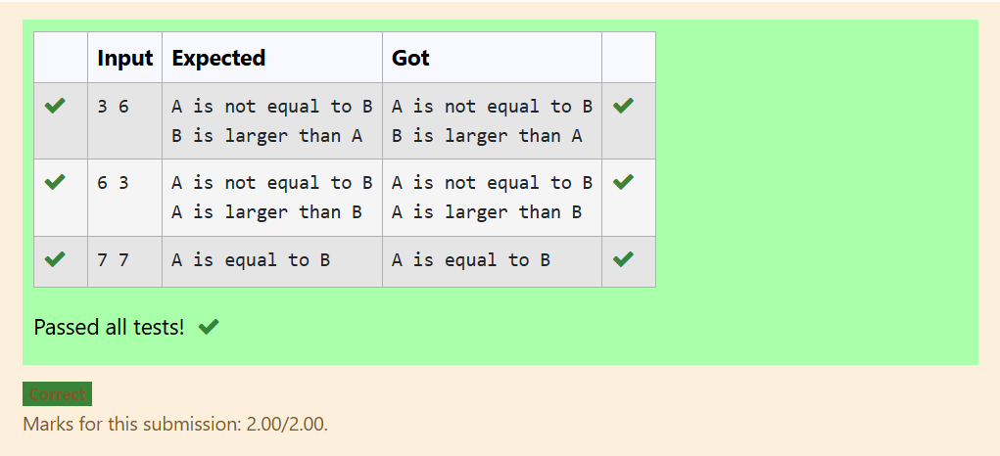

# MODULE-1
# EXP NO:1 C PROGRAM TO FIND THE ASCII VALUE OF A GIVEN CHARACTER
## AIM:
To write a C program to find and display the ASCII value of a given character.
## Algorithm:
1. Start
2. Declare a character variable ch.
3. Get a character input from the user using scanf().
4. Print the ASCII value of the entered character using print().
5. Stop the program.

## PROGRAM:
```
#include <stdio.h>
int main()
{
    char ch;
    scanf("%c", &ch);
    printf("ASCII value of %c is %d", ch, ch);
}
```
## Output:

## RESULT:
Thus, the program to find the ASCII value of a given character was executed and verified successfully.


# EXP NO:2 C PROGRAM TO COMPARE TWO NUMBERS USING NESTED IF-ELSE

## Aim:

Write a C program to read two whole numbers and figure out if they are the same or which one is bigger, using if-else statements.

## Algorithm:

1. Start.

2. Get two numbers (A and B) from the user.

3. Check if A equals B. If yes, say they are equal.

4. If not equal, print that fact. Then, check:

  . If B is bigger than A, say B is larger.

  .Otherwise, say A is larger.

5. Stop.

## Program:
```
#include <stdio.h>
int main(){
    int a,b;
    scanf("%d %d",&a,&b);
    if (a == b)
      printf("A is equal to B");
    else
    {
      printf("A is not equal to B");

      if (b>a)
       printf("\nB is larger than A");
      else
       printf("\nA is larger than B"); }
return 0;
}
```

## Output:

## Result:
The program to compare two numbers and find the largest using nested if-else was completed successfully.