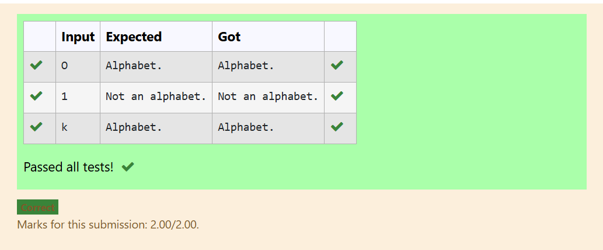

# MODULE-1
# EXP NO:1 C PROGRAM TO FIND THE ASCII VALUE OF A GIVEN CHARACTER
## AIM:
To write a C program to find and display the ASCII value of a given character.
## Algorithm:
1. Start
2. Declare a character variable ch.
3. Get a character input from the user using scanf().
4. Print the ASCII value of the entered character using printf().
5. Stop the program.

## PROGRAM:
```
#include <stdio.h>
int main()
{
    char ch;
    scanf("%c", &ch);
    printf("ASCII value of %c is %d", ch, ch);
}
```
## Output:

## RESULT:
Thus, the program to find the ASCII value of a given character was executed and verified successfully.

---
---
#

# EXP NO:2 C PROGRAM TO COMPARE TWO NUMBERS USING NESTED IF-ELSE

## Aim:

Write a C program to read two whole numbers and figure out if they are the same or which one is bigger, using if-else statements.

## Algorithm:

1. Start.

2. Get two numbers (A and B) from the user.

3. Check if A equals B. If yes, say they are equal.

4. If not equal, print that fact. Then, check:

    - If B is bigger than A, say B is larger.

    - Otherwise, say A is larger.

5. Stop.

## Program:
```
#include <stdio.h>
int main(){
    int a,b;
    scanf("%d %d",&a,&b);
    if (a == b)
      printf("A is equal to B");
    else
    {
      printf("A is not equal to B");

      if (b>a)
       printf("\nB is larger than A");
      else
       printf("\nA is larger than B"); }
return 0;
}
```

## Output:

## Result:

The program to compare two numbers and find the largest using nested if-else was completed successfully.

---
#


# EXP NO:3 C PROGRAM TO FIND THE AREA OF A RECTANGLE

## Aim:
To write a C program that calculates the area of a rectangle by taking its length and breadth as input using floating-point numbers.

## Algorithm:
1. Start.

2. Declare three floating-point variables: a (for length), b (for breadth), and A (for area).

3. Get the length (a) and breadth (b) from the user.

4. Calculate the area using the formula: 
    \[
         $$A = a \times b$$
    \]


5. Display the calculated area (A), formatted to show two decimal places.

6. Stop.

## Program:
```
#include <stdio.h>
int main(){
    float a,b,A;
    scanf("%f %f",&a,&b);
    A = a * b;
    printf("Area of rectangle=%.2f sq.units",A);
    return 0;
}
```

## Output:

## Result:

The C program to calculate the area of a rectangle using floating-point numbers was executed and verified successfully.

---
#

# EXP NO:4 C PROGRAM TO CHECK WHETHER A CHARACTER IS AN ALPHABET OR NOT

## Aim:

Write a C program that takes a single character input from the user and checks if it is a letter (a-z or A-Z) using an if-else statement.

## Algorithm:

1. Start.

2. Declare a character variable, ch.

3. Get a single character input from the user and store it in ch.

4. Check if ch falls in the range of lowercase letters ('a' to 'z') OR the range of uppercase letters ('A' to 'Z').

5. If True, print "Alphabet."

6. If False, print "Not an alphabet."

7. Stop.

## Program:
```
#include <stdio.h>
int main(){
    char ch;
    scanf("%c",&ch);
    if ((ch>='a'&&ch<='z')||(ch>='A'&&ch<='Z'))
        printf("Alphabet.");
    else
        printf("Not an alphabet.");
    return 0;
}
```

## Output:

## Result:

The program to check if a given character is an alphabet was executed and verified successfully using conditional logic.

---
#

# EXP NO:5 C PROGRAM TO CHECK POSITIVE OR NEGATIVE USING IF-ELSE

## Aim:

Write a C program to read a whole number from the user and determine if it is a positive number (greater than 0) or a negative number (0 or less).

## Algorithm:

1. Start.

2. Declare an integer variable, n.

3. Get an integer input from the user and store it in n.

4. Check the condition: Is n greater than 0?

5. If True (n > 0), print that the number is positive.

6. If False (the else block), print that the number is negative (this covers 0 and any number less than 0).

7. Stop.

## Program:
```
#include <stdio.h>
int main(){
    int n;
    scanf("%d",&n);
    if (n>0)
        printf("%d is positive.",n);
    else
        printf("%d is negative.",n);
    return 0;
}
```

## Output:

## Result:

The C program to determine if an integer is positive or negative using an if-else statement was successfully executed and verified.
#